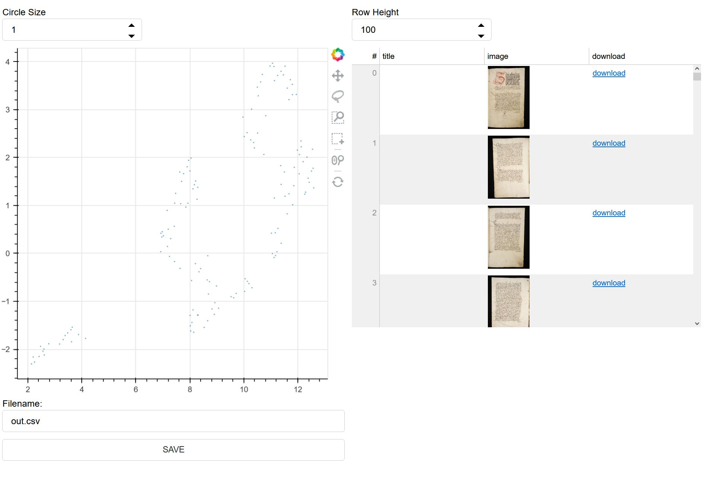

# Overview
**This Repisotory is a Work-in-Progress**

This repository is a work-in-progress for a way to scrape data from E-Codices, vectorize the images with VGG16, and then analyze the results using a Bokeh server application based on the Python library [bulk]("https://github.com/koaning/bulk"), which has been modified to work with local images. It also uses some of the code from [DeepImageSearch](https://github.com/TechyNilesh/DeepImageSearch) to vectorize images.

The repository comes with a fully-prepared application with images already vectorized and stored locally. The application is the folder myapp which houses the following file:

1. main.py (the bokeh server application)

Bokeh expects all images for a server to sit inside a ```static``` subdirectory. The static subdirectory contains the subdirectory ```images```. In here are ~120 sample images of medieval manuscripts from E-Codices.

# Usage
To use the application, you can move to the directory of the repository and execute the following command in your terminal.

```python -m bokeh serve myapp --show```

This will load a server onto localhost.


You can change the size of nodes in the top-left and change the height of your rows on the top-right. Using the lasso or square-grab features in the plot, you can isolate clusters of nodes to find patterns.

The application expects ready.csv to contain all image filenames in the image column and an optional title in the title column. To UMAP X/Y coordinates likewise, should be in the X, Y columns.

# Creating your Own Application
If you want to create your own application, you can vectorize your images witht encode_images notebook. Ensure that your image names correspond to the file location in the static subfolder of the application.
